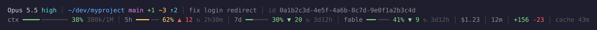

# claude-statusline

A two-row status line for [Claude Code](https://code.claude.com/docs/en/statusline). One Python file, standard library only.



## What it shows

**Top row:** model and effort level, directory with git branch and change counts, worktree, PR number, session name, session id.

**Bottom row:** context window used, the 5-hour and 7-day rate limits, session cost, elapsed time, lines added and removed, and how long the prompt cache stays warm.

## The pace marker

A limit at 62% tells you little without knowing how far into the window you are. The triangle is the difference between the two: percent used minus percent of the window elapsed.

- `▼ 20` (green): 20 points under pace. You will not hit the limit at this rate.
- `▲ 5` (yellow): slightly over pace.
- `▲ 12` (red): 10 or more points over. At this rate the limit arrives before the reset.

No triangle means you are exactly on pace, or the window has only just started.

`↻ 2h30m` is the time until that window resets.

## Install

Needs Python 3.9 or newer. Nothing to `pip install`.

```bash
git clone https://github.com/duplonicus/claude-statusline ~/.claude/claude-statusline
```

Then add this to `~/.claude/settings.json`:

```json
{
  "statusLine": {
    "type": "command",
    "command": "python3 ~/.claude/claude-statusline/src/statusline.py",
    "refreshInterval": 30
  }
}
```

`refreshInterval` keeps the reset and cache countdowns moving while the session is idle.

To preview it without Claude Code:

```bash
python3 scripts/demo.py        # full width
python3 scripts/demo.py 70     # as it looks in a 70-column terminal
```

## Narrow terminals

It always prints exactly two rows. When a row is too wide, segments shrink and then drop, least important first: the cache timer and line counts go before the rate limits, and the context gauge and the first 8 characters of the session id are never dropped.

## Notes

- Segments only appear when Claude Code sends the data. The rate-limit gauges show only when the session JSON includes rate-limit data; cost shows once the session has spent something.
- Git status is cached for 5 seconds per directory in `~/.cache/claude-statusline`, so slow repos do not stall the prompt.
- If a triangle or the reset icon overlaps the text after it, your terminal font is drawing that glyph wider than one cell. The script already puts a space after each for this reason.
- If the script hits an error it prints the error on the status line. It does not go blank.

## Tests

```bash
uvx pytest
```

## License

MIT
