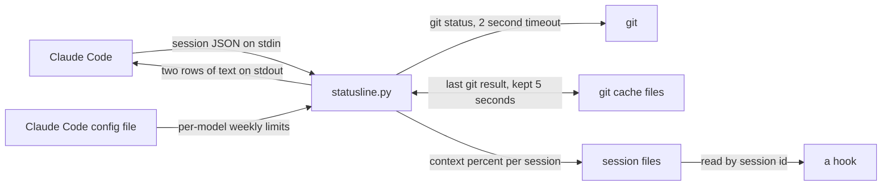

# claude-statusline

A two-row status line for [Claude Code](https://code.claude.com/docs/en/statusline). One Python file, standard library only.


## What it shows

**Top row:** model and effort level, directory with git branch and change counts, worktree, PR number, session name, session id.

**Bottom row:** context window used, the 5-hour and 7-day rate limits, any per-model weekly limit (such as Fable), session cost, elapsed time, lines added and removed, and how long the prompt cache stays warm.

## The pace marker

A limit at 62% tells you little without knowing how far into the window you are. The triangle is the difference between the two: percent used minus percent of the window elapsed.

- `▼ 20` (green): 20 points under pace. You will not hit the limit at this rate.
- `▲ 5` (yellow): slightly over pace.
- `▲ 12` (red): 10 or more points over. At this rate the limit arrives before the reset.

No triangle means you are exactly on pace, or the window has only just started.

`↻ 2h30m` is the time until that window resets.

## Install

Needs Python 3.9 or newer. Nothing to `pip install`.

```bash
git clone https://github.com/duplonicus/claude-statusline ~/.claude/claude-statusline
```

Then add this to `~/.claude/settings.json`:

```json
{
  "statusLine": {
    "type": "command",
    "command": "python3 ~/.claude/claude-statusline/src/statusline.py",
    "refreshInterval": 30
  }
}
```

`refreshInterval` keeps the reset and cache countdowns moving while the session is idle.

To preview it without Claude Code:

```bash
python3 scripts/demo.py        # full width
python3 scripts/demo.py 70     # as it looks in a 70-column terminal
```

## Narrow terminals

It always prints exactly two rows. When a row is too wide, segments shrink and then drop, least important first: the cache timer and line counts go before the rate limits, and the context gauge and the first 8 characters of the session id are never dropped.

## Notes

- Segments only appear when Claude Code sends the data. The rate-limit gauges show only when the session JSON includes rate-limit data; cost shows once the session has spent something.
- Git status is cached for 5 seconds per directory in `~/.cache/claude-statusline`, so slow repos do not stall the prompt.
- If a triangle or the reset icon overlaps the text after it, your terminal font is drawing that glyph wider than one cell. The script already puts a space after each for this reason.
- If the script hits an error it prints the error on the status line. It does not go blank.

## Per-model weekly limits

The usage screen in Claude Code can show a separate weekly meter for one model. The status line input does not include it: it carries only the 5-hour and 7-day windows.

Claude Code keeps the last answer it fetched for that screen in its config file (`~/.claude.json`, under `cachedUsageUtilization`). This script reads the per-model entries from there and shows each as its own meter, with the same pace marker.

Things to know:

- The number is only as fresh as that cache. Opening `/usage` in any session refreshes it. Past an hour old, the meter says so: `fable ██▉    48% ▼ 2 ↻ 3d12h (3h00m old)`.
- A reading whose week has already reset is not shown.
- That file is not a documented interface. If its shape changes, the meter disappears and nothing else breaks.

## Context usage for hooks

Claude Code hooks are not told how full the context window is. The status line is. So on every refresh this script also writes the figure to `~/.cache/claude-statusline/sessions/<session id>.json`:

```json
{"pct": 38, "t": 1791392326.4}
```

A `UserPromptSubmit` hook can read that file by the `session_id` it is given and act on it, for example telling the session to write its handoff notes at 60% instead of losing detail to auto-compact.

## How it works

*Last checked against the code on 2026-10-09, at commit 33116fd.*

The whole program is `src/statusline.py`. Claude Code starts it as a new process for each refresh, hands it the session as JSON on stdin, and shows whatever it prints. The script keeps nothing in memory between runs; anything it remembers is in a file.



### One run, step by step

1. Parse the JSON on stdin. Input that is not valid JSON becomes an empty session.
2. Save the context percentage to the session file (see "Context usage for hooks"). This is skipped when there is no session id, no reading, or the id has characters other than letters, digits, `_` and `-`.
3. Read the terminal width from `$COLUMNS` (120 if unset). The width each row may use is that minus 4, and never less than 20.
4. Build the two rows as lists of segments. A segment is added only when its data is in the input.
5. Fit each row to the width on its own (next section).
6. Print the two rows. If building them raises an error, print `statusline error: ...` instead.

### How a row is fitted

Each segment has a priority number and a list of variants, widest first. While the row is too wide, the script takes the segment with the highest priority number that still has a narrower variant and moves it one step down. So the highest-numbered segment shrinks all the way before the next one is touched.

| Row | Segment | Priority | Variants, widest first |
|---|---|---|---|
| Top | Model | 0 | model with effort, `fast` and agent name → model only |
| Top | Directory and git | 1 | short path, branch, counts → folder name, branch, counts → folder name, branch |
| Top | Session id | 2 | full id → first 8 characters |
| Top | Session name | 3 | cut at 40 characters → cut at 20 → dropped |
| Top | Worktree | 4 | shown → dropped |
| Top | PR | 5 | shown (a link when the input has a URL) → dropped |
| Bottom | Context | 0 | bar, percent, tokens → bar, percent → percent |
| Bottom | 5-hour limit | 1 | bar, percent, pace, reset → percent, pace, reset → percent |
| Bottom | 7-day limit | 2 | same as the 5-hour limit |
| Bottom | Per-model weekly limit | 3 | same as the 5-hour limit |
| Bottom | Spend limit | 4 | shown → dropped |
| Bottom | Cost | 5 | shown → dropped |
| Bottom | Elapsed time | 6 | shown → dropped |
| Bottom | Lines added and removed | 7 | shown → dropped |
| Bottom | Prompt cache | 8 | shown → dropped |

Width is counted after stripping the colour and link escape codes.

### Meters and colours

- Every meter is 6 cells wide and fills in eighths of a cell, so one step is about 2%. Any value above 0 lights at least one eighth.
- The context meter turns yellow at 50% and red at 80%. The limit meters turn yellow at 60% and red at 85%.
- The pace marker shows only when at least 3% of the window has passed and the difference rounds to something other than 0. It is red at 10 points over.
- A limit with no reset time, or one whose reset time has passed, shows the bar and percent only.

### Files it reads and writes

| File | Read or write | What it holds |
|---|---|---|
| `~/.cache/claude-statusline/<md5 of the directory>.json` | both | The last git result for that directory and when it was taken |
| `~/.cache/claude-statusline/sessions/<session id>.json` | write | Context percentage and the time it was written |
| `.claude.json` in `$CLAUDE_CONFIG_DIR`, or in the home directory when that is unset | read | Claude Code's cached usage data, for the per-model weekly limit |

Both cache writes go to a `.tmp` file first and are then renamed into place, so a reader never sees a half-written file.

Git is asked once per directory per 5 seconds: `git --no-optional-locks status --porcelain=v2 --branch`, with a 2 second timeout. If git times out, the last cached result is used, whatever its age. "Not a git repo" is cached too.

### Decisions and what they cost

| Decision | What it costs |
|---|---|
| Standard library only, one file. It starts fast and there is nothing to install. | Width is one cell per character. A glyph the terminal draws wider is not accounted for, which is why there is a space after each triangle and reset icon. |
| No state in memory. Each run is a new process and files carry anything that must last. | Every refresh pays for a Python start and a few small file reads. |
| Git status is cached for 5 seconds and has a 2 second timeout. | The branch and counts can be up to 5 seconds behind, or older after a timeout. |
| The per-model weekly limit comes from a file Claude Code writes for its own use, not from the status line input. | It is not a documented interface and the number can be old. Any unexpected shape shows no meter; a reading over an hour old shows its age. |
| The per-model meter is shown only when the input also carries rate-limit data. | No meter in a session that has no rate-limit data, even if the cached file has a reading. |
| `build` takes the git lookup and the per-model lookup as arguments. | Nothing at run time. It lets the tests and `scripts/demo.py` pass in fixed values. |
| An error is printed on the status line. | A bug is visible in every session until it is fixed. |

### Known limits

- If a row is still too wide when every segment is at its narrowest, it is printed as it is.
- The script never deletes its cache files. There is one small file per directory visited and one per session.
- The per-model meter depends on Claude Code refreshing its own cached usage data.

## Tests

```bash
uvx pytest
```

29 tests. One pins the exact text of a full-width render. The rest cover narrow widths, the pace arithmetic, the meter fill, git output parsing, empty and null input, the session files, and the per-model limit cache, plus one run of the script end to end as a subprocess.

## License

MIT
